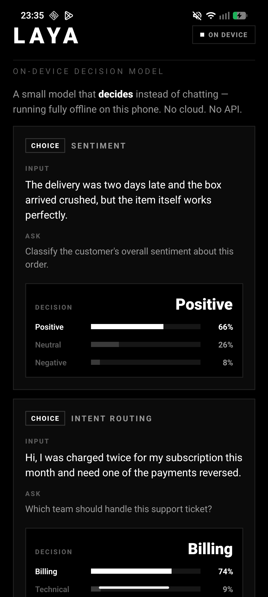
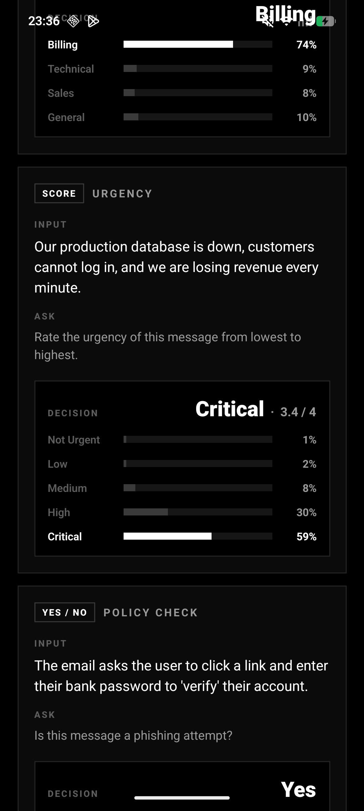
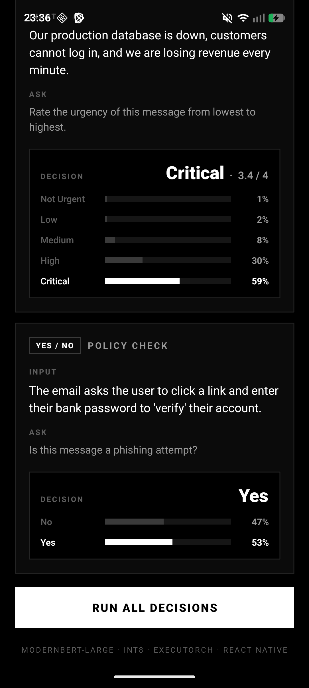

# Laya — React Native on-device demo

A React Native app that runs the **Laya** decision model fully offline on the phone using
[ExecuTorch](https://pytorch.org/executorch/) via
[`react-native-executorch`](https://github.com/software-mansion/react-native-executorch).
It shows four typed decisions (choice / score / yes-no) with calibrated confidence bars and
on-device inference time.

<p>
  
  
  
  
</p>

## Models

The `.pte` models are **not in git** (they're 600–850 MB). Download them from Hugging Face:

**🤗 [ksanjiv05/laya-for-rn-executorch](https://huggingface.co/ksanjiv05/laya-for-rn-executorch)**

| Platform | File | Backend | Size |
|---|---|---|---|
| **iOS** (recommended) | [`laya_coreml.pte`](https://huggingface.co/ksanjiv05/laya-for-rn-executorch/blob/main/laya_coreml.pte) | Core ML (Neural Engine / GPU) | 845 MB |
| iOS / Android | [`laya_xnnpack_int8wo.pte`](https://huggingface.co/ksanjiv05/laya-for-rn-executorch/blob/main/laya_xnnpack_int8wo.pte) | XNNPACK CPU, int8 | 603 MB |

See the model card for the runtime contract, the per-backend matrix (`BACKENDS.md`) and
`laya_testcases.json` (the reference answers this app is checked against).

```sh
# from rn-demo/
pip install -U huggingface_hub   # provides the `hf` CLI
hf download ksanjiv05/laya-for-rn-executorch laya_coreml.pte --local-dir assets/models           # iOS
hf download ksanjiv05/laya-for-rn-executorch laya_xnnpack_int8wo.pte --local-dir assets/models   # Android
```

To build the models yourself instead, see [`../export/`](../export/) (`export_laya_pte.py`,
and `export_ios.sh` for Core ML — macOS only).

## Benchmark

| Device | Model | Warm latency / decision | Result |
|---|---|---|---|
| **iPhone 15** | `laya_coreml.pte` | **~45 ms** (first run ~2.8 s warm-up) | 4/4 match reference |
| Android phone | `laya_xnnpack_int8wo.pte` | ~7.7 s | 4/4 match reference |

## Setup

Requires Node, [pnpm](https://pnpm.io) (the repo applies a patch to `react-native-executorch` via
`pnpm-workspace.yaml` → [`patches/`](patches/) for React Native 0.87 compatibility), and the usual
[React Native environment](https://reactnative.dev/docs/set-up-your-environment).

```sh
cd rn-demo
pnpm install
```

### iOS (iOS 17+, physical device recommended)

1. Download `laya_coreml.pte` into `assets/models/` (see above). It's already referenced by the
   Xcode project as a bundle resource (Copy Bundle Resources) and loaded from the app bundle.
2. Install pods and run:

   ```sh
   cd ios && bundle install && bundle exec pod install && cd ..
   pnpm start          # Metro, in one terminal
   pnpm ios --device   # or open ios/LayaExecutorchDemo.xcworkspace in Xcode and Run
   ```

To use the XNNPACK model on iOS instead, add `laya_xnnpack_int8wo.pte` to the Xcode target's bundle
resources and set `IOS_MODEL` in [`App.tsx`](App.tsx).

### Android

1. Download `laya_xnnpack_int8wo.pte` and push it to the app's storage:

   ```sh
   adb push assets/models/laya_xnnpack_int8wo.pte \
     /sdcard/Android/data/com.layaexecutorchdemo/files/laya_int8.pte
   ```

2. Run:

   ```sh
   pnpm start
   pnpm android
   ```

## How it works

- [`App.tsx`](App.tsx) loads the model with `useExecutorchModule({modelSource})` and feeds
  pre-tokenized inputs from [`assets/laya_testcases.json`](assets/laya_testcases.json)
  (`input_ids`, `attention_mask`, `marker_pos`, `marker_mask`, `qtype`).
- Outputs are the per-option logits; the app divides by the calibrated temperature, applies softmax,
  and shows argmax (`choice`), Σ i·pᵢ (`score`) or P(yes) (`noul`).
- Model path per platform is set by `MODEL_PATH` in `App.tsx`.
